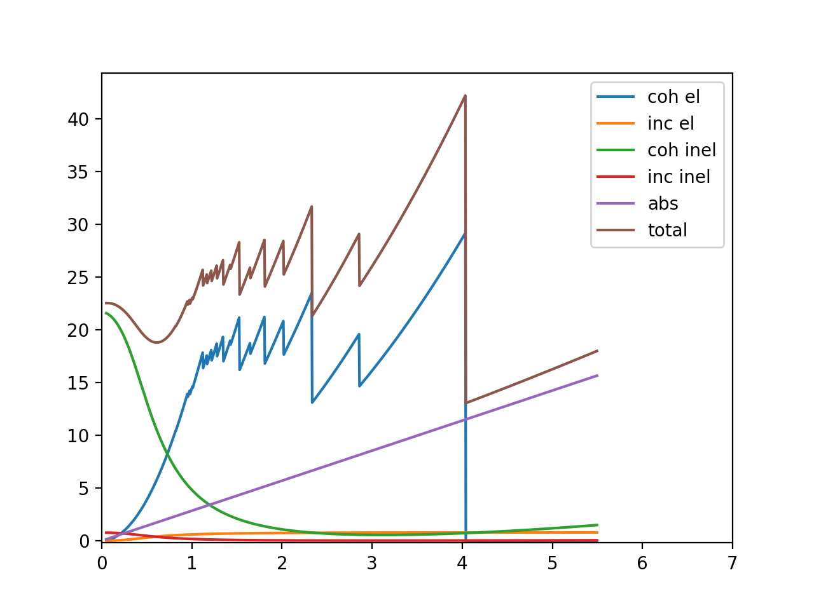
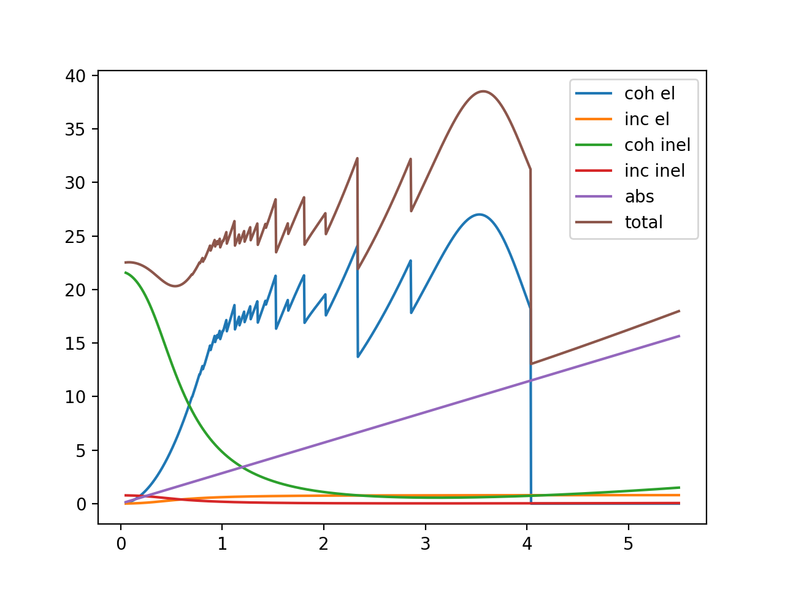
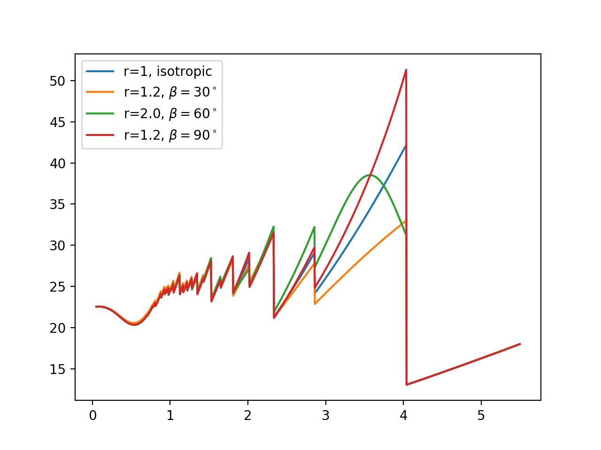
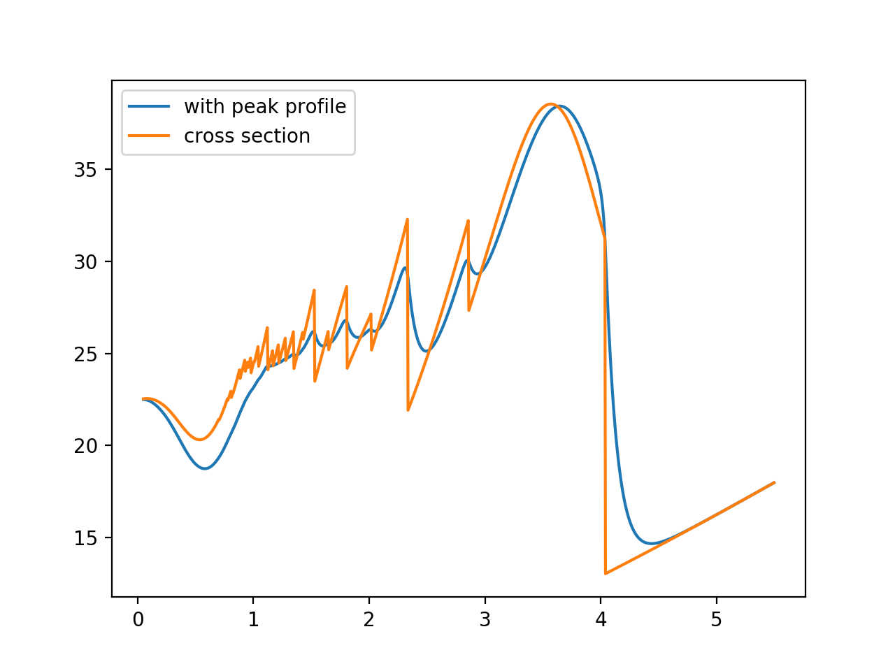

.. _tutorial:

Tutorial
========

Please see :ref:`installation` before start here.

This tutorial also exists as a jupyter notebook: https://github.com/ornlneutronimaging/braggedgemodeling/blob/master/notebooks/tutorial.ipynb

This tutorial walks through some basic steps of using braggedgemodeling for modeling of neutron Bragg edge spectrum.

First we import some essential tools::

  import os, numpy as np
  import warnings
  from matplotlib import pyplot as plt
  from bem.matter import Atom, Lattice, Structure

Atomic structure
----------------

The first step is to create a model of the material. Here we use bcc Fe as the example. In the following cell, we create the atomic structure of bcc Fe by adding atoms to a lattice with a space group::

  atoms = [Atom('Fe', (0,0,0)), Atom('Fe', (0.5, 0.5, 0.5))]
  a=2.856
  alpha = 90.
  lattice = Lattice(a=a, b=a, c=a, alpha=alpha, beta=alpha, gamma=alpha)
  astruct = Structure(atoms, lattice, sgid=229)

.. note:: You can also use :code:`bem.matter.loadCif(path)` to load an atomic structure
   from a CIF file::

     from bem.matter import loadCif
     astruct = loadCif(path)

No texture
----------

It is always good to start with a simplified case. Here we consider a bcc Fe sample without texture, and the following code computes and plots various contributions to the neutron cross section for this material.

The neutron Bragg edge spectrum is wavelength (𝜆) dependent, so we will calculate the cross sections as functions of  𝜆

Define wavelength axis::

  wavelengths = np.arange(0.05, 5.5, 0.005)

Experimental condition::
  
  T = 300 # Kelvin
  
Calculate cross sections
""""""""""""""""""""""""
  
Create calculator. Larger max_diffraction_index will lead to more accurate result at low wavelength::

  from bem import xscalc
  xscalculator = xscalc.XSCalculator(astruct, T, max_diffraction_index=4)

Compute various contributions

Note: in neutron Bragg Edge data analysis, it may not be necessary to calculate all these contributions, but it is useful to see them when exploring::

  coh_el_xs = xscalculator.xs_coh_el(wavelengths)
  inc_el_xs = xscalculator.xs_inc_el(wavelengths)
  abs_xs = xscalculator.xs_abs(wavelengths)
  coh_inel_xs = xscalculator.xs_coh_inel(wavelengths)
  inc_inel_xs = xscalculator.xs_inc_inel(wavelengths)
  # and the total cross section
  total = xscalculator.xs(wavelengths)
  # plot
  plt.figure()
  plt.plot(wavelengths, coh_el_xs, label='coh el')
  plt.plot(wavelengths, inc_el_xs, label='inc el')
  plt.plot(wavelengths, coh_inel_xs, label='coh inel')
  plt.plot(wavelengths, inc_inel_xs, label='inc inel')
  plt.plot(wavelengths, abs_xs, label='abs')
  plt.plot(wavelengths, total, label='total')
  plt.ylim(-0.2, None)
  plt.xlim(0,7)
  plt.legend()
  plt.show()

It will generate this plot:

Texture
-------

Here we introduce texture into the sample using the March Dollas model and see how it influence the spectrum

In March Dollase model,

* the 𝑟 parameter of a ℎ𝑘𝑙 indicates the degree of anisotropy;
* 𝑟ℎ𝑘𝑙=1 means the sample is isotropic with respect to the distribution of the particular ℎ𝑘𝑙;
* 𝛽 is the most probable angle of the preferred orientation
  
In the following, we create a March Dollas model and adjust the 𝑟 and 𝛽 for [011]::

  from bem import xtaloriprobmodel as xopm
  texture_model = xopm.MarchDollase()
  texture_model.r[(0,1,1)] = 2
  texture_model.beta[(0,1,1)] = np.deg2rad(60.)

calculate and plot::

  xscalculator = xscalc.XSCalculator(astruct, T, texture_model)

  plt.figure()
  with warnings.catch_warnings():
      warnings.simplefilter("ignore")
      # plotAll is a convenient method that calculates all contributions and plot them
      xscalculator.plotAll(wavelengths)
  plt.show()

This is the plot:

The following code consider the isotropic case and three texture cases for bcc Fe. This plot reproduces Figure 1 of https://doi.org/10.1088/1742-6596/251/1/012070::

  with warnings.catch_warnings():
      warnings.simplefilter("ignore")
      texture_model = xopm.MarchDollase()
      calc = xscalc.XSCalculator(astruct, T, texture_model, max_diffraction_index=5)
      # isotropic
      xs_0 = calc.xs(wavelengths)
      # r = 2, beta = 60.
      texture_model.r[(0,1,1)] = 2
      texture_model.beta[(0,1,1)] = 60./180.*np.pi
      xs_60 = calc.xs(wavelengths)
      # r = 1.2, beta = 30
      texture_model.r[(0,1,1)] = 1.2
      texture_model.beta[(0,1,1)] = 30./180.*np.pi
      xs_30 = calc.xs(wavelengths)
      # r = 1.2, beta = 90
      texture_model.r[(0,1,1)] = 1.2
      texture_model.beta[(0,1,1)] = 90./180.*np.pi
      xs_90 = calc.xs(wavelengths)

  plt.figure()
  plt.plot(wavelengths, xs_0, label='r=1, isotropic')
  plt.plot(wavelengths, xs_30, label='r=1.2, $\\beta=30^\\circ$')
  plt.plot(wavelengths, xs_60, label='r=2.0, $\\beta=60^\\circ$')
  plt.plot(wavelengths, xs_90, label='r=1.2, $\\beta=90^\\circ$')
  plt.legend(loc='upper left')
  plt.show()

The plot looks like this:

Peak profile
------------

The peak profile takes care of broadening due to neutron source::

  from bem import peak_profile as pp, calc
  jorgensen = pp.Jorgensen(alpha=[50, 0.], beta=[10, 0], sigma=[0, .003, 0])
  spectrum_calculator = calc.BraggEdgeSpectrumCalculator(xscalculator, jorgensen)
  # calculate total cross section convolved with peak profile
  with warnings.catch_warnings():
      warnings.simplefilter("ignore")
      spectrum = spectrum_calculator('total', wavelengths)
      xs = xscalculator.xs(wavelengths)
  # plot it
  plt.figure()
  plt.plot(wavelengths, spectrum, label='with peak profile')
  plt.plot(wavelengths, xs, label='cross section')
  plt.legend()
  plt.show()

The output:

